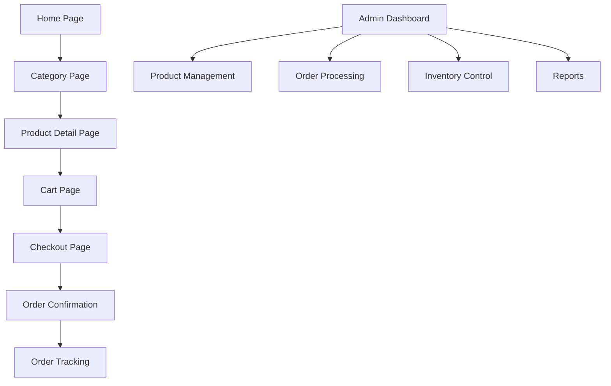

## 1. Product Overview
MeatKart is a mobile-first D2C e-commerce platform for fresh meat and seafood sales in India. The platform enables customers to order high-quality meat products online with reliable delivery and comprehensive order management.

Target market: Urban Indian consumers seeking convenient, fresh meat delivery with transparent pricing and quality assurance.

## 2. Core Features

### 2.1 User Roles
| Role | Registration Method | Core Permissions |
|------|---------------------|------------------|
| Customer | Mobile number OTP | Browse products, place orders, track deliveries, manage addresses |
| Admin | Pre-configured account | Manage products, orders, inventory, customers, generate reports |

### 2.2 Feature Module
Our MeatKart platform consists of the following main pages:
1. **Home page**: Product categories, featured products, search functionality
2. **Category page**: Product listing with filters, sorting options
3. **Product detail page**: Product images, pricing by weight, cut options, freshness info
4. **Cart page**: Order summary, quantity management, delivery slot selection
5. **Checkout page**: Address validation, payment options, order confirmation
6. **Order tracking page**: Real-time delivery status updates
7. **Admin dashboard**: Product management, order processing, inventory control
8. **Legal pages**: Privacy policy, terms & conditions, shipping policy, refund policy

### 2.3 Page Details
| Page Name | Module Name | Feature description |
|-----------|-------------|---------------------|
| Home page | Hero section | Display featured products with high-quality images, promotional banners, and category navigation |
| Home page | Category navigation | Quick access to Chicken, Mutton, Fish, Seafood categories with icon-based visual design |
| Home page | Search functionality | Real-time product search with autocomplete suggestions and filtering capabilities |
| Category page | Product grid | Display products with images, prices, weight options, and stock availability indicators |
| Category page | Filter system | Filter by price range, weight options, cut type, and availability status |
| Product detail page | Image gallery | Multiple product images with zoom functionality and freshness indicators |
| Product detail page | Weight selection | Dynamic pricing based on weight selection (500g, 1kg, custom weights) |
| Product detail page | Cut type options | Select from curry cut, boneless, whole pieces with real-time price updates |
| Product detail page | Freshness information | Display slaughter date, storage conditions, and quality assurance details |
| Product detail page | Delivery slot selector | Choose preferred delivery time slots with availability status |
| Cart page | Order summary | Display selected items with quantities, weights, and total pricing breakdown |
| Cart page | Delivery slot management | Select or modify delivery time slots for the entire order |
| Checkout page | Address validation | Pincode-based service availability check with address auto-suggestion |
| Checkout page | Payment options | Razorpay integration, Cash on Delivery selection with order amount validation |
| Checkout page | Order confirmation | Display order ID, estimated delivery time, and payment confirmation |
| Order tracking page | Status updates | Real-time order status: confirmed, preparing, out for delivery, delivered |
| Admin dashboard | Product management | Add/edit/delete products with multiple images, weight options, and pricing |
| Admin dashboard | Inventory control | Set daily stock availability, manage cut types, update freshness information |
| Admin dashboard | Order processing | View new orders, assign delivery personnel, update order status |
| Admin dashboard | Customer management | View customer details, order history, and contact information |
| Admin dashboard | Reports generation | Download CSV reports for orders, sales, and inventory data |

## 3. Core Process

### Customer Flow
1. Customer visits homepage and browses product categories
2. Selects category (Chicken, Mutton, Fish, Seafood) to view products
3. Chooses specific product with desired weight and cut type
4. Adds products to cart with delivery slot selection
5. Proceeds to checkout with address validation
6. Selects payment method (Razorpay or COD)
7. Receives order confirmation with tracking details
8. Receives notifications via WhatsApp/SMS for order updates
9. Tracks delivery status until order completion

### Admin Flow
1. Admin logs into dashboard with secure authentication
2. Manages product catalog with images and pricing
3. Sets daily inventory levels and availability
4. Processes incoming orders and assigns delivery
5. Updates order status throughout fulfillment process
6. Generates reports for business analysis
7. Manages customer communications and support

## 4. User Interface Design

### 4.1 Design Style
- **Primary Colors**: Deep red (#DC2626) for primary actions, white background, dark gray text
- **Secondary Colors**: Light gray (#F3F4F6) for backgrounds, green (#10B981) for success states
- **Button Style**: Rounded corners (8px radius), prominent shadows, clear hover states
- **Typography**: Inter font family, 16px base size, clear hierarchy with font weights 400, 500, 600
- **Layout**: Card-based design with generous spacing, mobile-first grid system
- **Icons**: Material Design icons with consistent sizing and color usage

### 4.2 Page Design Overview
| Page Name | Module Name | UI Elements |
|-----------|-------------|-------------|
| Home page | Hero section | Full-width banner with high-quality meat imagery, promotional text overlay, clear CTA buttons |
| Home page | Category cards | Square cards with category icons, subtle shadows, hover effects with color transitions |
| Product detail page | Image gallery | 500x500px product images with lightbox zoom, freshness badges with green indicators |
| Product detail page | Price display | Large font size (24px) for pricing, weight selection as segmented buttons |
| Cart page | Item cards | Horizontal cards with product images, quantity steppers, delete options |
| Checkout page | Form sections | Clean white cards with proper spacing, clear input labels, error validation styling |
| Admin dashboard | Data tables | Sortable columns, status badges with colors, action buttons with icons |

### 4.3 Responsiveness
Mobile-first design approach with breakpoints:
- Mobile: 320px - 768px (single column layout)
- Tablet: 768px - 1024px (two-column grid)
- Desktop: 1024px+ (multi-column layouts)
Touch-optimized interactions with appropriate tap targets (minimum 44px)

### 4.4 3D Scene Guidance
Not applicable for this e-commerce platform.