## 1. Architecture design


## 2. Technology Description
- Frontend: Next.js@14 + TypeScript + Tailwind CSS
- State Management: Zustand
- ORM: Prisma
- Database: PostgreSQL (Supabase)
- Authentication: Supabase Auth
- File Storage: Supabase Storage
- Payment Gateway: Razorpay
- Deployment: Vercel (frontend), Supabase (backend services)

## 3. Route definitions
| Route | Purpose |
|-------|---------|
| / | Homepage with featured products and categories |
| /category/[slug] | Product listing by category |
| /product/[id] | Individual product details page |
| /cart | Shopping cart management |
| /checkout | Order checkout with payment |
| /order/[id] | Order tracking and status |
| /admin | Admin dashboard login |
| /admin/dashboard | Admin dashboard overview |
| /admin/products | Product management |
| /admin/orders | Order management |
| /admin/inventory | Inventory control |
| /admin/reports | Business reports |
| /legal/[page] | Legal pages (privacy, terms, etc.) |

## 4. API definitions

### 4.1 Authentication APIs
```
POST /api/auth/login
```
Request:
| Param Name | Param Type | isRequired | Description |
|------------|-------------|-------------|-------------|
| phone | string | true | Mobile number for OTP |
| otp | string | false | OTP code for verification |

Response:
| Param Name | Param Type | Description |
|------------|-------------|-------------|
| success | boolean | Authentication status |
| token | string | JWT token for authenticated requests |
| user | object | User profile data |

### 4.2 Product APIs
```
GET /api/products
```
Request Query Parameters:
| Param Name | Param Type | Description |
|------------|-------------|-------------|
| category | string | Filter by category slug |
| limit | number | Number of products to return |
| offset | number | Pagination offset |

```
GET /api/products/[id]
```
Response:
| Param Name | Param Type | Description |
|------------|-------------|-------------|
| id | string | Product unique identifier |
| name | string | Product name |
| description | string | Product description |
| category | object | Category details |
| images | array | Product image URLs |
| weights | array | Available weight options with pricing |
| cuts | array | Available cut types |
| stock | number | Current stock level |
| freshness_date | date | Freshness indicator |

### 4.3 Order APIs
```
POST /api/orders
```
Request:
| Param Name | Param Type | isRequired | Description |
|------------|-------------|-------------|-------------|
| items | array | true | Array of product items with quantities |
| delivery_address | object | true | Delivery address details |
| delivery_slot | string | true | Preferred delivery time slot |
| payment_method | string | true | Payment method selection |

### 4.4 Cart APIs
```
POST /api/cart/add
```
Request:
| Param Name | Param Type | isRequired | Description |
|------------|-------------|-------------|-------------|
| product_id | string | true | Product identifier |
| weight | string | true | Selected weight option |
| quantity | number | true | Quantity to add |
| cut_type | string | false | Selected cut type |

## 5. Server architecture diagram


## 6. Data model

### 6.1 Data model definition

```mermaid
erDiagram
  USERS ||--o{ ORDERS : places
  USERS ||--o{ ADDRESSES : has
  CATEGORIES ||--o{ PRODUCTS : contains
  PRODUCTS ||--o{ PRODUCT_IMAGES : has
  PRODUCTS ||--o{ PRODUCT_WEIGHTS : has
  PRODUCTS ||--o{ CART_ITEMS : contains
  ORDERS ||--o{ ORDER_ITEMS : contains
  ORDERS ||--|| PAYMENTS : has
  ORDERS ||--|| DELIVERIES : has

  USERS {
    string id PK
    string phone UK
    string email
    string name
    string role
    timestamp created_at
    timestamp updated_at
  }

  CATEGORIES {
    string id PK
    string name
    string slug UK
    string description
    string image_url
    int display_order
  }

  PRODUCTS {
    string id PK
    string category_id FK
    string name
    string description
    string freshness_notes
    string cut_types
    boolean is_active
    int stock_quantity
    timestamp freshness_date
    timestamp created_at
    timestamp updated_at
  }

  PRODUCT_IMAGES {
    string id PK
    string product_id FK
    string image_url
    int display_order
    boolean is_primary
  }

  PRODUCT_WEIGHTS {
    string id PK
    string product_id FK
    string weight
    decimal price
    decimal discount_price
    boolean is_active
  }

  CART_ITEMS {
    string id PK
    string user_id FK
    string product_id FK
    string weight_id FK
    string cut_type
    int quantity
    timestamp created_at
  }

  ORDERS {
    string id PK
    string user_id FK
    string order_number UK
    decimal total_amount
    string status
    string delivery_slot
    string payment_method
    string payment_status
    timestamp created_at
    timestamp updated_at
  }

  ORDER_ITEMS {
    string id PK
    string order_id FK
    string product_id FK
    string weight_id FK
    string cut_type
    int quantity
    decimal unit_price
    decimal total_price
  }

  ADDRESSES {
    string id PK
    string user_id FK
    string type
    string street
    string city
    string state
    string pincode
    string landmark
    boolean is_default
  }

  PAYMENTS {
    string id PK
    string order_id FK
    string payment_method
    string payment_provider
    string transaction_id
    decimal amount
    string status
    json provider_response
    timestamp created_at
  }

  DELIVERIES {
    string id PK
    string order_id FK
    string delivery_person
    string status
    timestamp assigned_at
    timestamp delivered_at
    string notes
  }
```


### 6.2 Data Definition Language

Users Table
```sql
CREATE TABLE users (
  id UUID PRIMARY KEY DEFAULT gen_random_uuid(),
  phone VARCHAR(15) UNIQUE NOT NULL,
  email VARCHAR(255),
  name VARCHAR(100) NOT NULL,
  role VARCHAR(20) DEFAULT 'customer' CHECK (role IN ('customer', 'admin')),
  created_at TIMESTAMP WITH TIME ZONE DEFAULT NOW(),
  updated_at TIMESTAMP WITH TIME ZONE DEFAULT NOW()
);

CREATE INDEX idx_users_phone ON users(phone);
CREATE INDEX idx_users_role ON users(role);
```

Categories Table
```sql
CREATE TABLE categories (
  id UUID PRIMARY KEY DEFAULT gen_random_uuid(),
  name VARCHAR(100) NOT NULL,
  slug VARCHAR(100) UNIQUE NOT NULL,
  description TEXT,
  image_url VARCHAR(500),
  display_order INTEGER DEFAULT 0,
  created_at TIMESTAMP WITH TIME ZONE DEFAULT NOW(),
  updated_at TIMESTAMP WITH TIME ZONE DEFAULT NOW()
);

CREATE INDEX idx_categories_slug ON categories(slug);
```

Products Table
```sql
CREATE TABLE products (
  id UUID PRIMARY KEY DEFAULT gen_random_uuid(),
  category_id UUID REFERENCES categories(id) ON DELETE CASCADE,
  name VARCHAR(200) NOT NULL,
  description TEXT,
  freshness_notes VARCHAR(500),
  cut_types TEXT,
  is_active BOOLEAN DEFAULT true,
  stock_quantity INTEGER DEFAULT 0,
  freshness_date DATE,
  created_at TIMESTAMP WITH TIME ZONE DEFAULT NOW(),
  updated_at TIMESTAMP WITH TIME ZONE DEFAULT NOW()
);

CREATE INDEX idx_products_category ON products(category_id);
CREATE INDEX idx_products_active ON products(is_active);
```

Product Weights Table
```sql
CREATE TABLE product_weights (
  id UUID PRIMARY KEY DEFAULT gen_random_uuid(),
  product_id UUID REFERENCES products(id) ON DELETE CASCADE,
  weight VARCHAR(50) NOT NULL,
  price DECIMAL(10,2) NOT NULL,
  discount_price DECIMAL(10,2),
  is_active BOOLEAN DEFAULT true,
  created_at TIMESTAMP WITH TIME ZONE DEFAULT NOW()
);

CREATE INDEX idx_product_weights_product ON product_weights(product_id);
```

Orders Table
```sql
CREATE TABLE orders (
  id UUID PRIMARY KEY DEFAULT gen_random_uuid(),
  user_id UUID REFERENCES users(id) ON DELETE CASCADE,
  order_number VARCHAR(20) UNIQUE NOT NULL,
  total_amount DECIMAL(10,2) NOT NULL,
  status VARCHAR(50) DEFAULT 'pending',
  delivery_slot VARCHAR(100),
  payment_method VARCHAR(50) NOT NULL,
  payment_status VARCHAR(50) DEFAULT 'pending',
  delivery_address JSONB,
  created_at TIMESTAMP WITH TIME ZONE DEFAULT NOW(),
  updated_at TIMESTAMP WITH TIME ZONE DEFAULT NOW()
);

CREATE INDEX idx_orders_user ON orders(user_id);
CREATE INDEX idx_orders_status ON orders(status);
CREATE INDEX idx_orders_created ON orders(created_at DESC);
```

-- Grant permissions for Supabase
GRANT SELECT ON ALL TABLES IN SCHEMA public TO anon;
GRANT ALL PRIVILEGES ON ALL TABLES IN SCHEMA public TO authenticated;
GRANT USAGE, SELECT ON ALL SEQUENCES IN SCHEMA public TO authenticated;