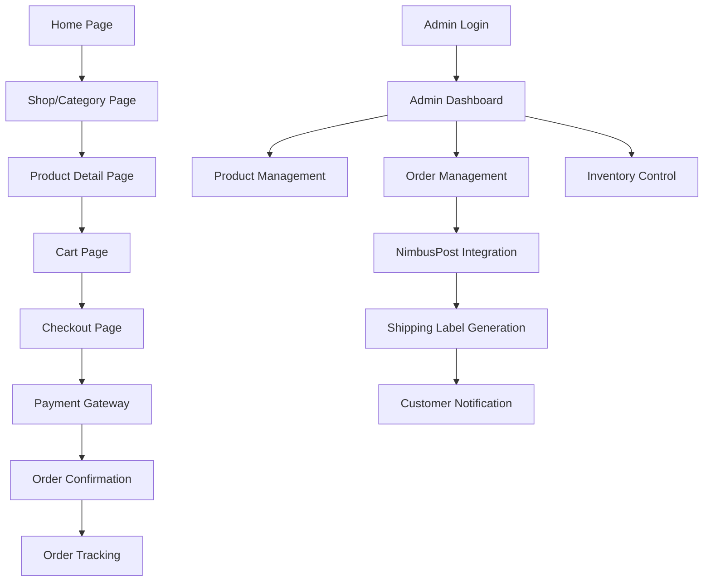

## 1. Product Overview
United Healthcare D2C Herbal E-Commerce Platform is a production-ready, scalable e-commerce website for selling herbal products directly to consumers in India. The platform solves the problem of manual order processing and compliance issues by providing automated shipping integration, FSSAI-compliant content management, and an intuitive admin panel that requires no developer dependency after launch.

Target market: Health-conscious consumers in India seeking authentic herbal products through a trusted online platform.

## 2. Core Features

### 2.1 User Roles
| Role | Registration Method | Core Permissions |
|------|---------------------|------------------|
| Customer | Guest checkout or email registration | Browse products, place orders, track shipments |
| Admin | Pre-configured admin account | Manage products, orders, inventory, view reports |

### 2.2 Feature Module
The herbal e-commerce platform consists of the following main pages:
1. **Home page**: Hero section, featured products, category navigation, testimonials
2. **Shop/Category page**: Product grid, filters, sorting, pagination
3. **Product detail page**: Image gallery, product information, add to cart, reviews
4. **Cart page**: Product summary, quantity adjustment, proceed to checkout
5. **Checkout page**: Shipping details, payment selection, order review
6. **Order confirmation page**: Success message, order details, tracking info
7. **Admin dashboard**: Product management, order management, inventory control
8. **Legal pages**: About, Contact, Privacy Policy, Terms, Shipping Policy, Refund Policy

### 2.3 Page Details
| Page Name | Module Name | Feature description |
|-----------|-------------|---------------------|
| Home page | Hero section | Display featured herbal products with auto-rotating banners showcasing wellness benefits |
| Home page | Featured products | Show 4-6 best-selling products with quick view option |
| Home page | Category navigation | Organize products by wellness categories (immunity, digestion, stress relief) |
| Shop page | Product grid | Display products in responsive grid with lazy loading |
| Shop page | Filters | Filter by category, price range, availability |
| Product detail | Image gallery | Multiple product images with zoom functionality and video support |
| Product detail | Product info | Display name, price, description, ingredients, benefits, stock status |
| Product detail | Add to cart | Quantity selector with stock validation |
| Cart page | Product summary | Show selected items with images, prices, quantities |
| Cart page | Quantity adjustment | Update quantities or remove items with real-time price calculation |
| Checkout page | Shipping form | Collect delivery address with mobile number validation |
| Checkout page | Payment selection | Choose between Razorpay, Cashfree, or COD |
| Checkout page | Order review | Final order summary before payment |
| Order confirmation | Success message | Display order ID and thank you message |
| Order confirmation | Tracking info | Show estimated delivery and tracking link |
| Admin dashboard | Product management | Add/edit/delete products with image/video upload |
| Admin dashboard | Order management | View and update order status, generate shipping labels |
| Admin dashboard | Inventory control | Update stock quantities, low stock alerts |
| Admin dashboard | Reports | Download sales reports in CSV format |

## 3. Core Process
**Customer Flow:**
1. Customer lands on homepage and browses featured products
2. Navigates to shop page to explore all products
3. Clicks on product to view detailed information
4. Adds product to cart with desired quantity
5. Proceeds to checkout from cart page
6. Enters shipping address and mobile number
7. Selects payment method (online payment or COD)
8. Completes payment and receives order confirmation
9. Receives automated notifications via WhatsApp, email, and SMS
10. Tracks order status through provided tracking link

**Admin Flow:**
1. Admin logs into secure dashboard
2. Adds new products with images, videos, and descriptions
3. Manages inventory levels and pricing
4. Reviews incoming orders and confirms payment status
5. Generates shipping labels through NimbusPost integration
6. Updates order status and tracking information
7. Monitors sales performance through dashboard analytics

## 4. User Interface Design

### 4.1 Design Style
- **Primary colors**: Natural green (#2D5016) representing herbal wellness
- **Secondary colors**: Warm earth tones (#8B4513, #F5F5DC) for trust and nature
- **Button style**: Rounded corners with subtle shadows, green primary buttons
- **Font**: Clean sans-serif (Inter or similar), 16px base size
- **Layout style**: Card-based design with generous whitespace
- **Icons**: Minimalist line icons with herbal/nature themes

### 4.2 Page Design Overview
| Page Name | Module Name | UI Elements |
|-----------|-------------|-------------|
| Home page | Hero section | Full-width banner with herbal product imagery, overlay text with wellness messaging, auto-rotation every 5 seconds |
| Home page | Featured products | 4-column grid on desktop, 2-column on mobile, product cards with hover effects |
| Shop page | Product grid | Responsive masonry layout, lazy loading images, loading skeletons |
| Product detail | Image gallery | Thumbnail navigation below main image, zoom on hover, video player integration |
| Product detail | Product info | Clear pricing display, stock status indicator, FSSAI disclaimer in subtle text |
| Cart page | Product summary | Clean table layout on desktop, card stack on mobile, prominent checkout button |
| Checkout page | Payment selection | Radio button selection with payment method logos, secure payment badges |
| Admin dashboard | Product management | Table view with search/filter, modal forms for editing, drag-drop image upload |

### 4.3 Responsiveness
Desktop-first design approach with mobile optimization. Breakpoints at 768px (tablet) and 1024px (desktop). Touch-friendly interface with appropriate tap targets and swipe gestures for image galleries.

### 4.4 3D Scene Guidance
Not applicable for this e-commerce platform.