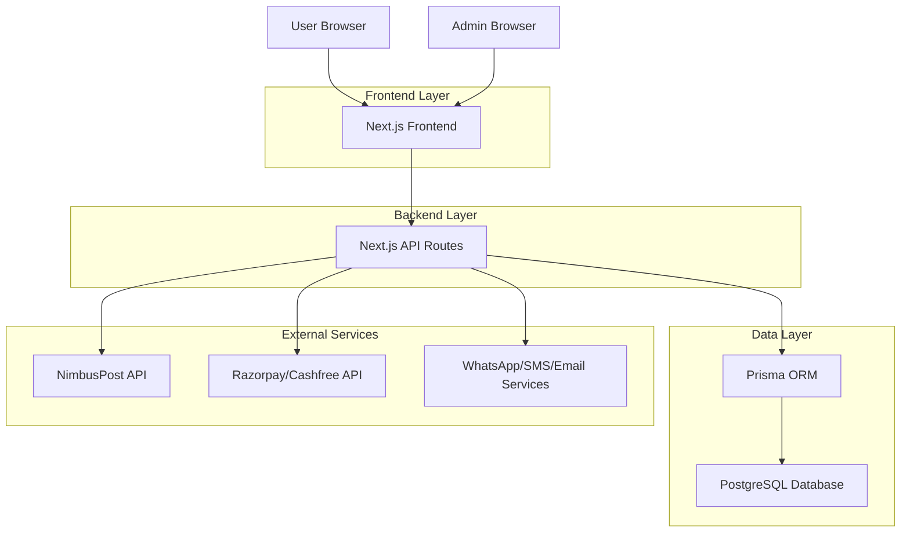
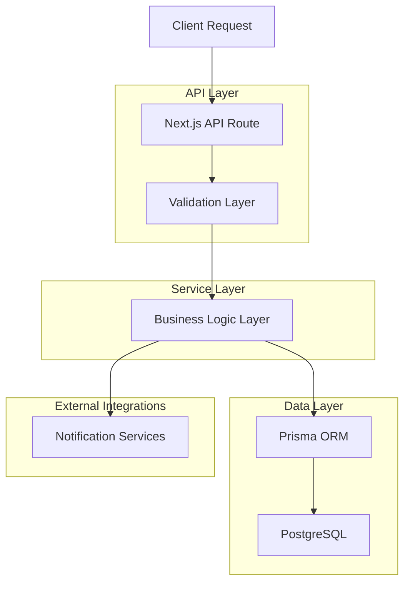
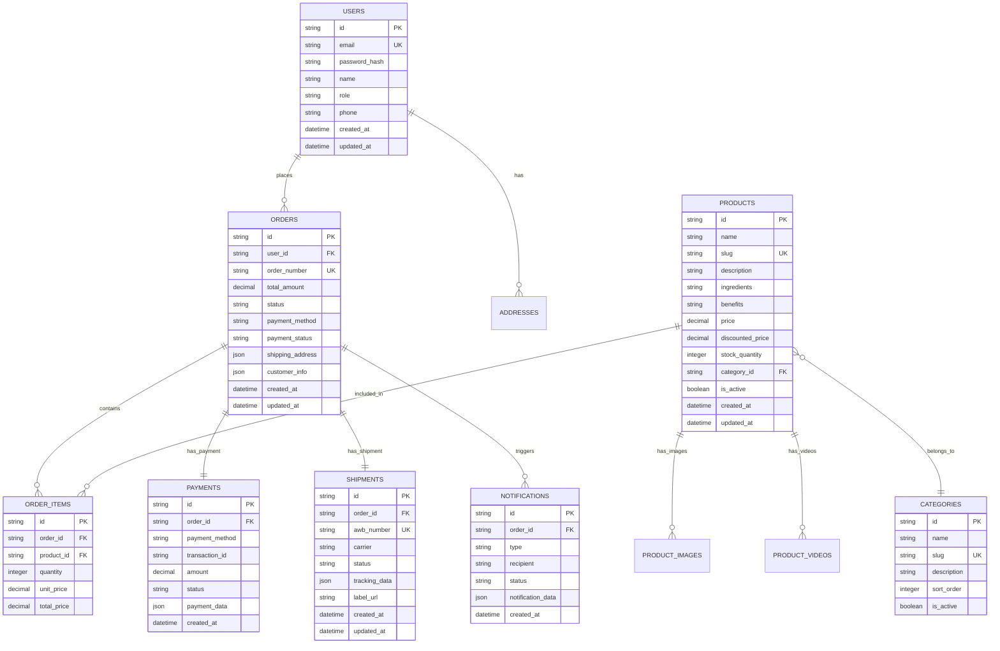

## 1. Architecture Design



## 2. Technology Description
- **Frontend**: Next.js 14 + TypeScript + Tailwind CSS
- **Backend**: Next.js API Routes + Server Actions
- **Database**: PostgreSQL with Prisma ORM
- **Authentication**: NextAuth.js with JWT tokens
- **Payment Integration**: Razorpay SDK, Cashfree SDK
- **Shipping Integration**: NimbusPost API
- **Notifications**: WhatsApp Business API, SendGrid/SMTP, SMS Gateway
- **File Storage**: AWS S3 or Supabase Storage
- **Analytics**: Google Analytics 4, Meta Pixel
- **Initialization Tool**: create-next-app

## 3. Route Definitions
| Route | Purpose |
|-------|---------|
| / | Homepage with featured products and categories |
| /shop | Product listing with filters and pagination |
| /shop/[category] | Category-specific product listings |
| /product/[slug] | Individual product detail page |
| /cart | Shopping cart with item management |
| /checkout | Multi-step checkout process |
| /order-confirmation/[id] | Order success page with tracking |
| /order-tracking/[id] | Order status tracking page |
| /about, /contact, /privacy, /terms | Legal and informational pages |
| /api/auth/* | Authentication endpoints |
| /api/products/* | Product CRUD operations |
| /api/orders/* | Order management endpoints |
| /api/payments/* | Payment processing endpoints |
| /api/shipping/* | Shipping integration endpoints |
| /api/notifications/* | Notification service endpoints |
| /admin | Admin dashboard login |
| /admin/dashboard | Main admin interface |
| /admin/products | Product management |
| /admin/orders | Order management |
| /admin/inventory | Inventory control |
| /admin/reports | Sales reports and analytics |

## 4. API Definitions

### 4.1 Authentication APIs
```
POST /api/auth/login
```
Request:
| Param Name | Param Type | isRequired | Description |
|------------|------------|------------|-------------|
| email | string | true | Admin email address |
| password | string | true | Admin password |

Response:
```json
{
  "success": true,
  "token": "jwt_token_string",
  "user": {
    "id": "user_id",
    "email": "admin@unitedhealthcare.com",
    "role": "admin"
  }
}
```

### 4.2 Product APIs
```
GET /api/products
```
Query Parameters:
| Param Name | Param Type | Description |
|------------|------------|-------------|
| category | string | Filter by category slug |
| page | number | Page number for pagination |
| limit | number | Items per page |
| sort | string | Sort by price, name, or date |

Response:
```json
{
  "products": [
    {
      "id": "product_id",
      "name": "Herbal Product Name",
      "slug": "herbal-product-slug",
      "price": 299.00,
      "discountedPrice": 249.00,
      "images": ["image_url_1", "image_url_2"],
      "stock": 50,
      "category": {
        "id": "category_id",
        "name": "Immunity Boosters",
        "slug": "immunity-boosters"
      }
    }
  ],
  "totalPages": 5,
  "currentPage": 1
}
```

### 4.3 Order APIs
```
POST /api/orders/create
```
Request:
| Param Name | Param Type | isRequired | Description |
|------------|------------|------------|-------------|
| items | array | true | Array of product items with quantities |
| shippingAddress | object | true | Customer shipping details |
| paymentMethod | string | true | "razorpay", "cashfree", or "cod" |
| customerInfo | object | true | Customer contact information |

Response:
```json
{
  "success": true,
  "orderId": "order_unique_id",
  "paymentRequired": true,
  "paymentData": {
    "razorpay_order_id": "rzp_order_id"
  }
}
```

### 4.4 Payment APIs
```
POST /api/payments/verify
```
Request:
| Param Name | Param Type | isRequired | Description |
|------------|------------|------------|-------------|
| razorpay_order_id | string | true | Razorpay order ID |
| razorpay_payment_id | string | true | Razorpay payment ID |
| razorpay_signature | string | true | Razorpay signature for verification |

Response:
```json
{
  "success": true,
  "orderId": "order_unique_id",
  "status": "paid"
}
```

### 4.5 Shipping APIs
```
POST /api/shipping/create-shipment
```
Request:
| Param Name | Param Type | isRequired | Description |
|------------|------------|------------|-------------|
| orderId | string | true | Order ID for shipment |
| pickupAddress | object | true | Warehouse pickup details |
| deliveryAddress | object | true | Customer delivery details |

Response:
```json
{
  "success": true,
  "awbNumber": "awb_tracking_number",
  "labelUrl": "shipping_label_pdf_url",
  "trackingUrl": "tracking_page_url"
}
```

## 5. Server Architecture Diagram



## 6. Data Model

### 6.1 Data Model Definition


### 6.2 Data Definition Language

**Users Table**
```sql
CREATE TABLE users (
  id UUID PRIMARY KEY DEFAULT gen_random_uuid(),
  email VARCHAR(255) UNIQUE NOT NULL,
  password_hash VARCHAR(255) NOT NULL,
  name VARCHAR(100) NOT NULL,
  phone VARCHAR(15),
  role VARCHAR(20) DEFAULT 'customer' CHECK (role IN ('customer', 'admin')),
  is_active BOOLEAN DEFAULT true,
  created_at TIMESTAMP WITH TIME ZONE DEFAULT NOW(),
  updated_at TIMESTAMP WITH TIME ZONE DEFAULT NOW()
);

CREATE INDEX idx_users_email ON users(email);
CREATE INDEX idx_users_role ON users(role);
```

**Categories Table**
```sql
CREATE TABLE categories (
  id UUID PRIMARY KEY DEFAULT gen_random_uuid(),
  name VARCHAR(100) NOT NULL,
  slug VARCHAR(100) UNIQUE NOT NULL,
  description TEXT,
  sort_order INTEGER DEFAULT 0,
  is_active BOOLEAN DEFAULT true,
  created_at TIMESTAMP WITH TIME ZONE DEFAULT NOW(),
  updated_at TIMESTAMP WITH TIME ZONE DEFAULT NOW()
);

CREATE INDEX idx_categories_slug ON categories(slug);
CREATE INDEX idx_categories_active ON categories(is_active);
```

**Products Table**
```sql
CREATE TABLE products (
  id UUID PRIMARY KEY DEFAULT gen_random_uuid(),
  name VARCHAR(200) NOT NULL,
  slug VARCHAR(200) UNIQUE NOT NULL,
  description TEXT NOT NULL,
  ingredients TEXT,
  benefits TEXT,
  price DECIMAL(10,2) NOT NULL,
  discounted_price DECIMAL(10,2),
  stock_quantity INTEGER DEFAULT 0,
  category_id UUID REFERENCES categories(id),
  is_active BOOLEAN DEFAULT true,
  created_at TIMESTAMP WITH TIME ZONE DEFAULT NOW(),
  updated_at TIMESTAMP WITH TIME ZONE DEFAULT NOW()
);

CREATE INDEX idx_products_slug ON products(slug);
CREATE INDEX idx_products_category ON products(category_id);
CREATE INDEX idx_products_active ON products(is_active);
CREATE INDEX idx_products_price ON products(price);
```

**Product Images Table**
```sql
CREATE TABLE product_images (
  id UUID PRIMARY KEY DEFAULT gen_random_uuid(),
  product_id UUID REFERENCES products(id) ON DELETE CASCADE,
  image_url VARCHAR(500) NOT NULL,
  alt_text VARCHAR(200),
  sort_order INTEGER DEFAULT 0,
  is_primary BOOLEAN DEFAULT false,
  created_at TIMESTAMP WITH TIME ZONE DEFAULT NOW()
);

CREATE INDEX idx_product_images_product ON product_images(product_id);
CREATE INDEX idx_product_images_primary ON product_images(is_primary);
```

**Orders Table**
```sql
CREATE TABLE orders (
  id UUID PRIMARY KEY DEFAULT gen_random_uuid(),
  user_id UUID REFERENCES users(id),
  order_number VARCHAR(20) UNIQUE NOT NULL,
  total_amount DECIMAL(10,2) NOT NULL,
  status VARCHAR(50) DEFAULT 'pending' CHECK (status IN ('pending', 'confirmed', 'processing', 'shipped', 'delivered', 'cancelled')),
  payment_method VARCHAR(50) NOT NULL,
  payment_status VARCHAR(50) DEFAULT 'pending',
  shipping_address JSONB NOT NULL,
  customer_info JSONB NOT NULL,
  created_at TIMESTAMP WITH TIME ZONE DEFAULT NOW(),
  updated_at TIMESTAMP WITH TIME ZONE DEFAULT NOW()
);

CREATE INDEX idx_orders_user ON orders(user_id);
CREATE INDEX idx_orders_number ON orders(order_number);
CREATE INDEX idx_orders_status ON orders(status);
CREATE INDEX idx_orders_created ON orders(created_at DESC);
```

**Order Items Table**
```sql
CREATE TABLE order_items (
  id UUID PRIMARY KEY DEFAULT gen_random_uuid(),
  order_id UUID REFERENCES orders(id) ON DELETE CASCADE,
  product_id UUID REFERENCES products(id),
  quantity INTEGER NOT NULL CHECK (quantity > 0),
  unit_price DECIMAL(10,2) NOT NULL,
  total_price DECIMAL(10,2) NOT NULL,
  created_at TIMESTAMP WITH TIME ZONE DEFAULT NOW()
);

CREATE INDEX idx_order_items_order ON order_items(order_id);
CREATE INDEX idx_order_items_product ON order_items(product_id);
```

**Payments Table**
```sql
CREATE TABLE payments (
  id UUID PRIMARY KEY DEFAULT gen_random_uuid(),
  order_id UUID REFERENCES orders(id),
  payment_method VARCHAR(50) NOT NULL,
  transaction_id VARCHAR(100),
  amount DECIMAL(10,2) NOT NULL,
  status VARCHAR(50) DEFAULT 'pending',
  payment_data JSONB,
  created_at TIMESTAMP WITH TIME ZONE DEFAULT NOW()
);

CREATE INDEX idx_payments_order ON payments(order_id);
CREATE INDEX idx_payments_transaction ON payments(transaction_id);
```

**Shipments Table**
```sql
CREATE TABLE shipments (
  id UUID PRIMARY KEY DEFAULT gen_random_uuid(),
  order_id UUID REFERENCES orders(id),
  awb_number VARCHAR(50) UNIQUE,
  carrier VARCHAR(100),
  status VARCHAR(50) DEFAULT 'created',
  tracking_data JSONB,
  label_url VARCHAR(500),
  created_at TIMESTAMP WITH TIME ZONE DEFAULT NOW(),
  updated_at TIMESTAMP WITH TIME ZONE DEFAULT NOW()
);

CREATE INDEX idx_shipments_order ON shipments(order_id);
CREATE INDEX idx_shipments_awb ON shipments(awb_number);
```

**Notifications Table**
```sql
CREATE TABLE notifications (
  id UUID PRIMARY KEY DEFAULT gen_random_uuid(),
  order_id UUID REFERENCES orders(id),
  type VARCHAR(50) NOT NULL CHECK (type IN ('whatsapp', 'email', 'sms')),
  recipient VARCHAR(255) NOT NULL,
  status VARCHAR(50) DEFAULT 'pending',
  notification_data JSONB,
  created_at TIMESTAMP WITH TIME ZONE DEFAULT NOW()
);

CREATE INDEX idx_notifications_order ON notifications(order_id);
CREATE INDEX idx_notifications_type ON notifications(type);
CREATE INDEX idx_notifications_status ON notifications(status);
```